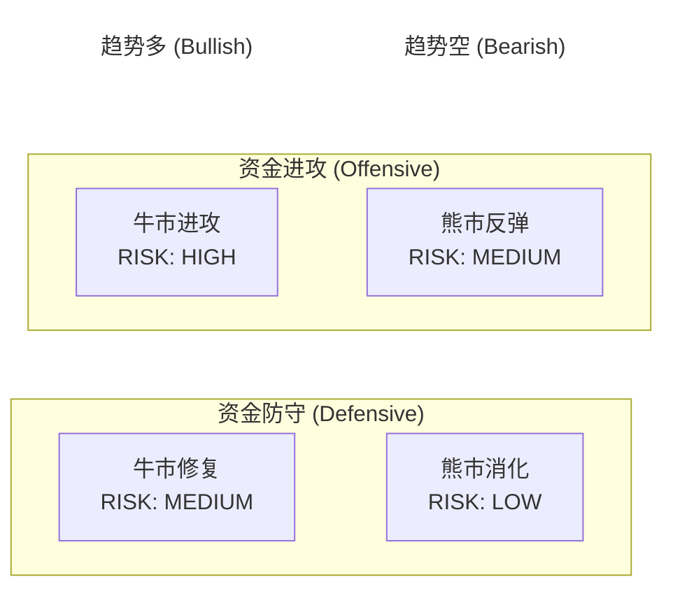

# Crypto Market State Machine
## 加密市场状态机（牛熊状态机）

将复杂的市场分析，压缩成一个**数据驱动的四象限状态机**：  
你每天只需要输入两类数据（趋势结构 + 资金姿态），系统就能输出当前 BTC 市场处于哪一个状态，并用校验层给出风险温度与 ETF 加速提示。

> ⚠️ 免责声明：本项目仅用于研究与教育，不构成任何投资建议。

---

## 愿景

用**数据驱动的方法**替代情绪化的市场判断，帮助投资者清晰了解：
- 当前处于牛/熊的哪个阶段？
- 资金是在进攻还是防守？
- 风险温度是否过高？
- ETF 是否在放大趋势？

---

## 核心概念：Input → 四象限 Output → 校验层（不改变状态）

- **Input A：趋势结构（MA50 / MA200）** → 输出 `Trend = 趋势多 / 趋势空`
- **Input B：资金姿态（Stablecoin vs TOTAL）** → 输出 `Funding = 资金进攻 / 资金防守`
- **Output：四象限状态（2×2）** → 直接定位到 4 个状态之一
- **校验层：ATH / ETF** → 不改变象限，只输出风险与可信度提示

---

## 四象限状态（核心输出）

> 用户打开四象限图的那一刻，应该能立刻看到现在 BTC 处于哪一格。



---

## 🚀 快速开始

### 前置要求

- Python 3.10+
- pip 或 poetry

### 快速开始

1. **配置后端环境**

```bash
cd backend
cp env.example .env
```

编辑 `.env` 文件，添加API密钥（见下方说明）

2. **安装后端依赖**

```bash
cd backend
pip install fastapi uvicorn requests python-dotenv
```

3. **启动后端服务**

```bash
python -m uvicorn bullbear_backend.main:app --reload --host 0.0.0.0 --port 8000
```

后端将在 **http://localhost:8000** 运行

4. **启动前端应用**

```bash
cd frontend
pnpm install
pnpm dev
```

前端将在 **http://localhost:5173** 运行

### 测试API

```bash
# 健康检查
curl http://localhost:8000/api/health

# 获取市场状态
curl http://localhost:8000/api/state

# 获取所有数据
curl http://localhost:8000/api/data
```

或者运行测试脚本：

```bash
python test_connection.py
```

### 查看API文档

打开浏览器访问：**http://localhost:8000/docs**

---

## 📁 项目结构

```
bullbear-dashboard/
├── backend/              # Python FastAPI 后端
│   ├── bullbear_backend/
│   │   ├── data/         # 数据获取层
│   │   └── state_machine/ # 状态机引擎
│   └── main.py           # FastAPI 应用入口
├── frontend/             # Vue.js 前端
│   └── src/              # 前端源代码
└── docs/                # 项目文档
```

---

## 🔧 开发说明

### 配置API密钥

1. 获取API密钥：
   - [CoinMarketCap API](https://coinmarketcap.com/api/) - 用于获取BTC价格和市场数据
   - [TAAPI.io](https://taapi.io/) - 用于获取技术指标（可选，如果使用Binance则不需要）

2. 编辑 `backend/.env`:
```
CMC_API_KEY=your_coinmarketcap_api_key
TAAPI_SECRET=your_taapi_secret
```

**注意**：Binance API是免费的，无需API密钥即可使用。如果使用Binance作为数据源，只需要配置CoinMarketCap API密钥即可。

### 状态机逻辑（当前简化版）

- **趋势判断**: BTC价格 > MA50 > MA200 → 趋势多，否则趋势空
- **资金姿态**: 稳定币占比 < 8% → 资金进攻，否则资金防守
- **状态映射**: 趋势 × 资金姿态 → 四象限状态

> 这是最简单的实现版本，后续会根据社区反馈持续改进。

---

## 📚 文档

- [状态模型设计](docs/STATE_MODEL.md)
- [数据来源说明](docs/DATA_SOURCES.md)
- [贡献指南](docs/CONTRIBUTING.md)
- [后端README](backend/README.md)

---

## 🤝 贡献

欢迎贡献！请查看 [贡献指南](docs/CONTRIBUTING.md) 了解如何参与。

---

## ⚠️ 免责声明

本项目仅用于研究与教育目的，不构成任何投资建议。使用本项目的任何决策和后果由用户自行承担。
